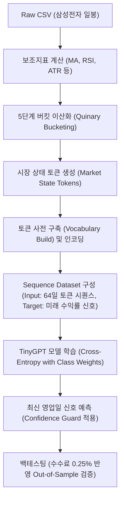
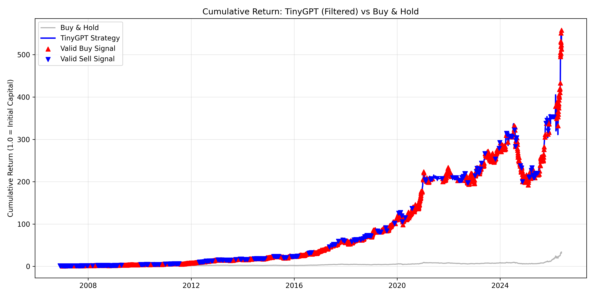
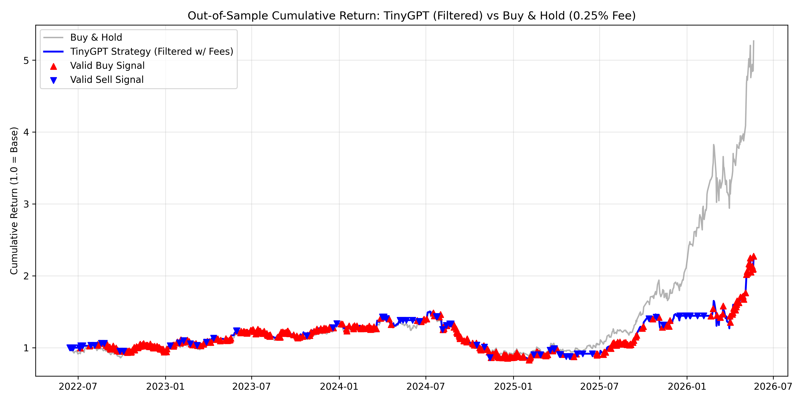

# TinyGPT Stock Trading Signal Model (Samsung Electronics)

이 프로젝트는 Karpathy의 `makemore` 시리즈 중 GPT-2 스타일의 Transformer Decoder 아키텍처(Notebook 06)를 차용하여, 주식 시장(삼성전자)의 일봉 데이터를 분석하고 최적의 매수(BUY) / 관망(HOLD) / 매도(SELL) 신호를 예측하는 딥러닝 프로젝트입니다.

이 프로젝트의 구현 코드는 [tiny_GPT_trading_signal_real.ipynb](file:///c:/Users/dulee0930/Desktop/2026-1/TinyGPT/tiny_GPT_trading_signal_real.ipynb)에 담겨 있습니다.

---

## 💡 핵심 아이디어 (Discretization & Tokenization)

전형적인 시계열 회귀 분석(Regression) 모델은 주가나 보조지표의 연속적인 실수(Float) 값을 직접 입력으로 받습니다. 하지만 이 모델은 다음과 같은 독창적인 방식을 사용합니다.

1. **시장 상태 토큰화 (Market State Tokenization)**: 주가 변화율, 거래량 비율, RSI, 변동성 등 6가지 핵심 재무 지표를 각각 5단계(Quinary Bucket)로 이산화(Discretization)한 후, 이를 결합하여 하나의 문자 토큰(String Token)으로 결합합니다.
   * *예시 토큰*: `T_FLAT|M5_NEU|M20_NEG|RSI_NEUTRAL|VOL_NORMAL|RNG_LOW` (추세는 횡보, 5일 모멘텀은 중립, 20일 모멘텀은 하락, RSI는 중립, 거래량은 평균, 변동성은 낮음)
2. **언어 모델처럼 처리**: 하나의 주식 거래일을 하나의 '단어(Token)'로, 최근 64일간의 시장 흐름을 하나의 '문장(Sentence)'으로 취급하여 GPT 모델에게 시장의 역사적 패턴을 읽게 합니다.
3. **분류 헤드(Classification Head) 적용**: 문맥 창(`block_size=64`)의 마지막 토큰 시점에서 추출된 은닉 상태(Hidden State)를 바탕으로, 미래 $H$일 동안의 수익률을 예측하는 분류(Classification)를 수행합니다.

---

## 💡 자연어 대신 금융 데이터를 학습시키는 이론적 정당화

GPT와 같은 자연어 처리(NLP) 기반 Transformer 모델을 이산화된 금융 데이터에 적용하는 것은 단순한 비유를 넘어 다음과 같은 강력한 수학적/이론적 정당성을 갖습니다.

### 1) 시장의 '언어(Vocabulary)' 정의 및 이산화 (Market Vocabulary & Regularization)
* **NLP 관점**: 자연어는 이미 알파벳이나 형태소 단위로 쪼개진 이산 토큰(Discrete Token)으로 구성되어 있으며, 이를 통해 복잡한 의미를 전달합니다.
* **금융 관점**: 금융 시계열 데이터(주가, 거래량 등)는 본질적으로 연속적인 실수(Float) 형태이므로 잡음(Noise)이 매우 심합니다. 실수 값을 그대로 학습할 경우, 딥러닝 모델은 무의미한 미세 변동(Micro-fluctuations)에 과적합(Overfitting)되기 쉽습니다.
* **정당화**: 추세, 모멘텀, RSI, 거래량, 변동성을 분위수(Quantile) 기준의 5단계(Quinary Bucket)로 이산화(Discretization)하고 이를 하나의 문자열 토큰(예: `T_FLAT|M5_NEU|...`)으로 결합함으로써, 시장의 잡음을 걸러내는 강력한 정규화(Regularization) 효과를 얻습니다. 이 과정은 연속형 정보의 핵심만 압축하여 "시장의 이산적 언어(Vocabulary of the Market)"를 구축하는 과정입니다.

### 2) 시간적 경로 의존성과 어텐션 메커니즘 (Temporal Path-dependency & Attention)
* **NLP 관점**: 문장에서 단어의 의미는 이전 문맥의 흐름(Context)에 따라 결정됩니다. 단순히 바로 앞 단어만 보고 예측하는 Bigram 모델은 한계가 분명합니다.
* **금융 관점**: 효율적 시장 가설(EMH)의 약형 가설에 따르면 과거 주가 패턴으로 미래 주가를 예측할 수 없다고 하지만, 행동재무학 및 시장 마이크로스트럭처 관점에서 시장은 추세 형성(Momentum), 반전(Mean-reversion), 변동성 전이(Volatility Clustering) 등의 특성을 보이며 경로 의존성(Path-dependency)을 가집니다.
* **정당화**: Transformer의 **Causal Self-Attention** 메커니즘은 과거 64일간의 문맥 창(`block_size=64`) 내에서 현재의 시장 상태와 유사한 패턴이나 국면(Regime)을 동적으로 조회(Query-Key Matching)하여 가중합합니다. 이를 통해 단순히 직전 거래일의 정보(1차 마르코프 가정)를 넘어, 과거 역사적 흐름 속에서 현재와 유의미한 연관성을 가지는 시점들에 주의(Attention)를 집중시켜 신호를 형성합니다.

### 3) 비선형 요인 상호작용 (Non-linear Factor Interaction)
* **NLP 관점**: 개별 단어 자체의 의미보다 단어들이 조합되어 문장을 이룰 때 풍부한 문맥적 맥락(Semantic Context)이 생겨납니다.
* **금융 관점**: 단일 보조지표(예: RSI만 단독으로 보거나 변동성만 보는 것)로는 시장의 복잡한 국면을 설명하기 어렵습니다. 모멘텀이 상승세(`M5_POS`)이더라도 거래량이 급감(`VOL_LOW`)하거나 변동성이 매우 높으면(`RNG_HIGH`) 이는 추세 지속 신호가 아닌 단기 고점 신호일 수 있습니다.
* **정당화**: Multi-Head Attention은 6가지 시장 지표가 결합된 다차원 토큰들 사이의 복합적인 상호작용과 시계열적 흐름을 다각도(Multi-Head)로 파악합니다. 전통적인 선형 회귀나 고정된 의사결정 나무(Decision Tree)가 포착하기 힘든 고차원 비선형 지표 결합 패턴을 효과적으로 학습할 수 있습니다.

### 4) 인과적 마스킹을 통한 미래 정보 누수 방지 (Causal Masking & No Lookahead Bias)
* **NLP 관점**: 디코더(Decoder) 기반 GPT 모델은 미래 단어를 미리 보고 현재 단어를 예측할 수 없도록 하삼각 마스크(Causal Mask)를 적용합니다.
* **금융 관점**: 금융 예측에서 가장 빈번하게 발생하는 치명적인 오류는 미래의 정보가 학습 데이터에 침투하는 미래 참조 오류(Lookahead Bias/Data Leakage)입니다.
* **정당화**: Causal Self-Attention의 하삼각 마스킹은 $t$ 시점의 예측이 오직 $0 \sim t$ 시점의 과거 시장 상태 토큰들만 참조할 수 있도록 엄격히 보장합니다. 이는 시계열 데이터의 인과 관계(Causal Relationship)를 깨뜨리지 않고 신경망을 병렬 학습시킬 수 있는 강력한 수학적 도구입니다.

---

## 🛠️ 전체 파이프라인 구조



---

## 1. 데이터 및 피처 엔지니어링 (Feature Engineering)

### 1) 입력 데이터 ([Samsung_Daily_Data_yfinance.csv](file:///c:/Users/dulee0930/Desktop/2026-1/TinyGPT/Samsung_Daily_Data_yfinance.csv))
* 야후 파이낸스(yfinance) 등에서 추출한 일봉 데이터로, 시가(`Open`), 고가(`High`), 저가(`Low`), 종가(`Close`), 거래량(`Volume`) 등을 포함합니다.

### 2) 보조지표 계산
* **이격도 (Close-MA Gap)**: 종가와 20일 이동평균선의 괴리율
* **단기 모멘텀 (`ret_5`)**: 5일 주가 수익률
* **중기 모멘텀 (`ret_20`)**: 20일 주가 수익률
* **상대강도지수 (`rsi14`)**: 14일 기준 RSI
* **거래량 비율 (`volume_ratio`)**: 현재 거래량 대비 20일 이동평균 거래량 비율
* **변동성 프록시 (`atr_proxy`)**: 최근 14일 동안의 일중 변동폭(고가-저가)의 이동평균 비율

### 3) 5단계 버킷 및 토큰 문자열 조합 (`make_market_state_tokens`)
각 지표의 크기에 따라 분위수(Boundary)를 기준으로 5가지 텍스트 라벨을 부여합니다.

* **추세 (Trend)**: `S_DOWN` (이격도 $\le -5\%$) / `DOWN` / `FLAT` ($|이격도| < 1.5\%$) / `UP` / `S_UP` ($\ge 5\%$)
* **단기 모멘텀 (M5)**: `S_NEG` (수익률 $\le -3\%$) / `NEG` / `NEU` ($|수익률| < 1\%$) / `POS` / `S_POS` ($\ge 3\%$)
* **중기 모멘텀 (M20)**: `S_NEG` (수익률 $\le -6\%$) / `NEG` / `NEU` ($|수익률| < 2\%$) / `POS` / `S_POS` ($\ge 6\%$)
* **RSI**: `OVERSOLD` ($\le 30$) / `WEAK` / `NEUTRAL` ($45 \sim 55$) / `STRONG` / `OVERBOUGHT` ($\ge 70$)
* **거래량 (VOL)**: `V_LOW` ($\le 60\%$) / `LOW` / `NORMAL` / `HIGH` / `V_HIGH` ($\ge 150\%$)
* **변동성 (RNG)**: `V_LOW` ($\le 1.5\%$) / `LOW` / `NORMAL` / `HIGH` / `V_HIGH` ($\ge 4.5\%$)

이 지표들을 조합하여 하나의 고유한 문자열 토큰으로 결합합니다. 조합된 토큰은 고유 정수 ID로 맵핑되며, 사전에 없는 신규 패턴은 `<UNK>`로 처리됩니다.

---

## 2. 타겟 신호 라벨링 (Target Labeling)

미래 $H$일 간의 선행 수익률(`future_return`)을 기준으로 학습 레이블(`label_id`)을 계산합니다.
* **BUY (2)**: 미래 수익률 $\ge$ `buy_threshold` (예: $+2\%$)
* **SELL (0)**: 미래 수익률 $\le$ `sell_threshold` (예: $-2\%$)
* **HOLD (1)**: 주가 변동폭이 임계값 이내일 때

---

## 3. Tiny GPT 모델 아키텍처 (`TinyGPTTradingSignal`)

이 모델은 [notebook_06.ipynb](file:///c:/Users/dulee0930/Desktop/2026-1/TinyGPT/notebook_06.ipynb)의 디코더 모델 구조와 동일한 뼈대를 갖지만, 최종 출력 레이어가 문자 생성 대신 3클래스 분류(Classification)를 수행한다는 차이점이 있습니다.

```mermaid
graph TD
    %% Input Layer
    subgraph Input ["1. Input & Embeddings"]
        Tokens["입력 시퀀스 토큰 ID (B, T=64)"]
        Pos["위치 인덱스 (T=64)"]
        TokEmb["Token Embedding (nn.Embedding) - Vocab Size to C=96"]
        PosEmb["Position Embedding (nn.Embedding) - block_size to C=96"]
        Add["합산 (Element-wise Add)"]
        Drop1["Dropout (0.15)"]

        Tokens --> TokEmb
        Pos --> PosEmb
        TokEmb & PosEmb --> Add
        Add --> Drop1
    end

    %% Transformer Blocks (x3)
    subgraph Blocks ["2. Transformer Blocks (x3 Layers)"]
        direction TB
        BlockIn["Block Input (h_l-1)"]
        
        %% MHA branch
        LN1["LayerNorm (Pre-LN)"]
        subgraph MHA ["Causal Multi-Head Self-Attention (4 Heads)"]
            QKVProj["Q, K, V 선형 투영 (Linear Projection)"]
            Split["4개 헤드로 분할 (d_k = 24)"]
            Attention["Scaled Dot-Product Attention: softmax(QKᵀ / √d_k + M) V"]
            CausalMask["하삼각 인과적 마스크 (Causal Mask) M 적용"]
            Concat["헤드 병렬 연산 및 연결 (Concat)"]
            OutProj["출력 투영 (Linear Projection)"]
            
            QKVProj --> Split
            Split --> CausalMask
            CausalMask --> Attention
            Attention --> Concat
            Concat --> OutProj
        end
        Add1["잔차 연결 (Residual Add)"]
        
        %% FFN branch
        LN2["LayerNorm (Pre-LN)"]
        subgraph FFN ["Feed-Forward Network (FFN)"]
            Linear1["Linear Layer (C to 4C)"]
            Activation["ReLU 활성화 함수"]
            Linear2["Linear Layer (4C to C)"]
            FFNDrop["Dropout (0.15)"]
            
            Linear1 --> Activation
            Activation --> Linear2
            Linear2 --> FFNDrop
        end
        Add2["잔차 연결 (Residual Add)"]
        BlockOut["Block Output (h_l)"]

        BlockIn --> LN1
        BlockIn --> Add1
        LN1 --> QKVProj
        OutProj --> Add1
        
        Add1 --> LN2
        Add1 --> Add2
        LN2 --> Linear1
        FFNDrop --> Add2
        Add2 --> BlockOut
    end

    %% Output Layer
    subgraph Output ["3. Final Classification Head"]
        FinalLN["최종 LayerNorm"]
        ExtractLast["마지막 시점 은닉 벡터 추출: h[:, -1, :] (B, C=96)"]
        ClsHead["Linear 분류기 (C=96 to 3)"]
        Logits["Logits (B, 3)"]
        Softmax["Softmax"]
        Probs["신호 확률 (SELL / HOLD / BUY)"]

        FinalLN --> ExtractLast
        ExtractLast --> ClsHead
        ClsHead --> Logits
        Logits --> Softmax
        Softmax --> Probs
    end

    Drop1 --> BlockIn
    BlockOut --> FinalLN

    %% Styling
    style Input fill:#eef2f7,stroke:#3b5998,stroke-width:2px;
    style Blocks fill:#fcfcfc,stroke:#2b2b2b,stroke-width:2px;
    style MHA fill:#fff7e6,stroke:#ff9900,stroke-width:1px;
    style FFN fill:#e6f7ff,stroke:#1890ff,stroke-width:1px;
    style Output fill:#f6ffed,stroke:#52c41a,stroke-width:2px;
```



### 1) 상세 모델 구조 및 수학적 연산 흐름

#### ① 토큰 및 위치 임베딩 (Token & Position Embeddings)

모델에 입력되는 64일간의 시장 상태 시퀀스는 토큰화 및 임베딩 단계를 거쳐 트랜스포머의 입력 차원으로 변환됩니다.

* **입력 시퀀스 (Input Context)**
  최근 $T$ 영업일의 이산 시장 상태 토큰 시퀀스는 다음과 같이 나타낼 수 있습니다:

$$x = [x_1, x_2, \dots, x_T] \in \mathbb{R}^{B \times T}$$

  * $B$: 배치 크기 (Batch Size)
  * $T$: 컨텍스트 창 크기 (시퀀스 길이, `block_size` = 64)

* **토큰 임베딩 (Token Embedding)**
  `nn.Embedding`을 통해 고유 토큰들을 밀집 벡터로 변환합니다:

$$E_{\text{tok}}(x) \in \mathbb{R}^{B \times T \times C}$$

  * $C$: 모델의 임베딩 차원 (`emb_dim` = 96)

* **위치 임베딩 (Position Embedding)**
  토큰의 시간적 순서 정보를 제공하기 위해 절대 위치 임베딩 벡터를 더해줍니다:

$$E_{\text{pos}}(p) \in \mathbb{R}^{T \times C}$$

* **합산 (Summation)**
  두 임베딩의 합이 트랜스포머 블록에 전송되는 최초의 입력 벡터 $h_0$가 됩니다:

$$h_0 = E_{\text{tok}}(x) + E_{\text{pos}}(p) \in \mathbb{R}^{B \times T \times C}$$

---

#### ② 인과적 멀티헤드 어텐션 (Causal Multi-Head Attention)

각 블록 내의 어텐션 레이어는 과거 데이터의 인과관계를 유지하면서 중요한 패턴에 주의를 집중합니다.

* **선형 투영 (Linear Projection)**
  입력 특징 $h \in \mathbb{R}^{B \times T \times C}$를 사용하여 쿼리($Q$), 키($K$), 값($V$) 벡터를 도출합니다:

$$Q = h W_Q, \quad K = h W_K, \quad V = h W_V$$

  * $W_Q, W_K, W_V \in \mathbb{R}^{C \times C}$: 선형 투영 가중치 파라미터

* **인과적 마스크 적용 및 어텐션 계산 (Causal Masked Attention)**
  설정된 헤드 수(`num_heads` = 4)에 따라 분할하여 계산하며, 각 헤드 차원 $d_k = C / h_{\text{num}} = 24$를 기준으로 scaled dot-product 어텐션을 수행합니다. 이때 미래 시점을 참조하는 Lookahead Bias를 차단하기 위해 **인과적 마스크(Causal Mask)** $M$을 적용합니다:

$$\text{Attention}(Q, K, V) = \text{softmax}\left(\frac{Q K^T}{\sqrt{d_k}} + M\right) V$$

  여기서 $M_{ij}$는 다음과 같이 정의됩니다:

$$M_{ij} = \begin{cases} 0 & (i \ge j) \\ -\infty & (i < j) \end{cases}$$

  마스킹된 영역($i < j$)은 소프트맥스 연산 시 가중치가 0이 되므로 정보가 미래에서 과거로 역류하는 것을 수학적으로 완전히 차단합니다.

* **출력 투영 (Output Projection)**
  병렬적으로 연산된 각 헤드의 결과를 결합한 후, 최종 선형 레이어를 통과시킵니다:

$$\text{Output} = \text{Concat}(\text{head}_1, \dots, \text{head}_4) W_O$$

  * $W_O \in \mathbb{R}^{C \times C}$: 출력 선형 투영 가중치

---

#### ③ Pre-LN 트랜스포머 블록 구조 (Pre-LN Transformer Blocks)

학습의 안정성을 높이기 위해 레이어 정규화(LayerNorm)를 잔차 연결(Residual Connection) 직전에 수행하는 Pre-LN 구조를 적용합니다.

* **멀티헤드 어텐션 블록 (Causal MHA Block)**

$$\tilde{h}_l = h_{l-1} + \text{MHA}(\text{LN}(h_{l-1}))$$

  * $\text{LN}$: 레이어 정규화 (LayerNorm)
  * $\text{MHA}$: Causal Multi-Head Attention

* **피드포워드 네트워크 블록 (FFWD Block)**

$$h_l = \tilde{h}_l + \text{FFWD}(\text{LN}(\tilde{h}_l))$$

$$\text{FFWD}(y) = \text{ReLU}(y W_1 + b_1) W_2 + b_2$$

  * $W_1 \in \mathbb{R}^{C \times 4C}$, $b_1 \in \mathbb{R}^{4C}$
  * $W_2 \in \mathbb{R}^{4C \times C}$, $b_2 \in \mathbb{R}^{C}$

---

#### ④ 분류 헤드 및 최종 신호 매핑 (Classification Head)

* **정보 압축 (Extract Last Hidden State)**
  자연어 생성 모델과 달리, 거래 예측 모델은 마지막 영업일 시점(Last Time-step)의 압축된 정보만을 사용합니다:

$$h_{\text{last}} = h_L[:, -1, :] \in \mathbb{R}^{B \times C}$$

  * $L$: 트랜스포머 레이어 스택 깊이 (3)

* **로그 확률 계산 (Logits Projection)**
  압축된 은닉 상태 $h_{\text{last}}$를 분류용 선형 레이어(`nn.Linear`)에 입력하여 최종 3가지 거래 신호에 대한 스코어를 연산합니다:

$$\text{logits} = h_{\text{last}} W_{\text{class}} + b_{\text{class}} \in \mathbb{R}^{B \times 3}$$

  * $W_{\text{class}} \in \mathbb{R}^{C \times 3}$, $b_{\text{class}} \in \mathbb{R}^3$

* **확률 도출**
  Logits에 소프트맥스를 취해 최종 거래 행동 확률을 계산합니다:

$$\text{probabilities} = \text{softmax}(\text{logits})$$

  * 클래스 매핑: SELL (0), HOLD (1), BUY (2)

### 2) 모델 구성 클래스
* **[Head](file:///c:/Users/dulee0930/Desktop/2026-1/TinyGPT/tiny_GPT_trading_signal_real.ipynb#L217-L247)**: 단일 인과적(Causal) 어텐션 헤드로, 미래 정보를 참조할 수 없도록 하삼각 마스킹(`tril`)을 적용합니다.
* **[MultiHeadAttention](file:///c:/Users/dulee0930/Desktop/2026-1/TinyGPT/tiny_GPT_trading_signal_real.ipynb#L249-L266)**: 여러 개의 어텐션 헤드를 병렬 연산하고 합친 뒤 선형 투영합니다.
* **[FeedForward](file:///c:/Users/dulee0930/Desktop/2026-1/TinyGPT/tiny_GPT_trading_signal_real.ipynb#L268-L282)**: $W_1 x + b_1 \rightarrow \text{ReLU} \rightarrow W_2 x + b_2$ 구조의 MLP 채널 정제망입니다.
* **[Block](file:///c:/Users/dulee0930/Desktop/2026-1/TinyGPT/tiny_GPT_trading_signal_real.ipynb#L284-L298)**: Pre-LN 기반의 레이어 정규화와 어텐션, FFWD 및 잔차 연결을 조합한 디코더 블록입니다.
* **[TinyGPTTradingSignal](file:///c:/Users/dulee0930/Desktop/2026-1/TinyGPT/tiny_GPT_trading_signal_real.ipynb#L300-L337)**: 위의 요소들을 취합하여 토큰/위치 임베딩을 거쳐 시퀀스 특징을 만들고, 시퀀스의 마지막 시점 은닉 벡터(`h[:, -1, :]`)를 추출하여 3개의 출력 신호 점수로 매핑합니다.

---

### 3) Notebook 06 (TinyGPT)과의 차이점 비교

이 프로젝트의 `TinyGPTTradingSignal`은 `notebook_06.ipynb`에서 다루는 표준적인 문자 단위 GPT 디코더 모델을 모태로 하고 있으나, 풀고자 하는 문제의 정의와 도메인의 특성에 맞춰 아래와 같이 중요한 구조적/기능적 차이점을 지닙니다.

| 비교 항목 | Notebook 06 (텍스트 생성 GPT) | TinyGPT Trading Signal (주식 거래 신호 모델) |
| :--- | :--- | :--- |
| **태스크 유형 (Task)** | **생성 모델 (Generative LM)**<br>주어진 컨텍스트 뒤에 올 다음 문자(Char) 생성 | **분류 모델 (Sequence Classification)**<br>최근 $T$일의 흐름을 읽고 미래 수익률 신호 분류 |
| **입력 데이터 (Domain)** | **자연어 텍스트** (Shakespeare) | **이산화된 시장 상태 토큰** (`T_UP\|M5_POS\|...`) |
| **어휘 사전 크기 (Vocab Size)** | **65** (알파벳, 문장부호, 공백 등 고정) | **약 1,000~1,200+** (시장 상태 조합에 따라 유동적) |
| **출력 차원 (Output Shape)** | `(Batch, Sequence, Vocab_Size)` | `(Batch, Num_Classes = 3)` (SELL / HOLD / BUY) |
| **출력 추출 및 손실 계산** | 시퀀스 내 **모든 위치**의 다음 토큰 예측 오차 합산<br>(Loss computed over all time-steps) | 시퀀스의 **마지막 시점 은닉 상태** `h[:, -1, :]`만 추출하여 분류기에 입력 후 단일 손실 계산 |
| **평가 및 검증 분할** | **랜덤 분할 (Random Split)**<br>텍스트 문장의 순서와 무관하게 데이터셋 분할 | **시계열 분할 (Time-series Split)**<br>미래 정보 누수(Lookahead Bias) 차단을 위해 과거/미래로 엄격히 분할 |
| **출력 디코딩 / 예측 제어** | **확률적 샘플링** (Temperature, Top-k 등 적용)<br>다양하고 자연어스러운 문장을 생성하기 위함 | **Confidence Guard (확신도 가드)**<br>예측 확률이 설정한 임계값 미만일 시 HOLD로 보수화 |
| **손실 함수 보정** | **일반 Cross-Entropy** | **Class-weighted Cross-Entropy**<br>지배적인 HOLD 신호로 인한 편향 학습(Bias) 완화 |
| **모델 규모 (하이퍼파라미터)** | `emb_dim = 128`, `num_heads = 4`<br>`num_layers = 4`, `dropout = 0.1` | `emb_dim = 96`, `num_heads = 4`<br>`num_layers = 3`, `dropout = 0.15` |

---

## 4. 모델 학습 기법 및 사양

* **클래스 불균형 완화 (`make_class_weights`)**: 금융 시계열 데이터의 특성상 `HOLD` 신호의 비율이 지배적입니다. 손실 함수 내에서 과도한 HOLD 편향을 막기 위해 훈련 데이터 내 레이블 빈도의 역수를 계산해 손실 가중치(`class_weights`)로 반영합니다.
* **학습률 스케줄러**: `CosineAnnealingLR`을 활용하여 초기 `lr=5e-4`에서 시작해 최소 5% 수준까지 코사인 곡선을 그리며 학습률을 조절합니다.
* **조기 종료 (Early Stopping)**: 검증 Loss가 연속 6에폭 동안 유의미하게 개선되지 않으면 학습을 정지하고 최적 가중치를 복원합니다.
* **가중치 파라미터**: `emb_dim = 96`, `num_heads = 4`, `num_layers = 3`, `dropout = 0.15`

---

## 5. 실전 리스크 관리: Confidence Guard

안정적인 자산 운용을 위해 모델 예측 확률값에 가드(Guard) 장치를 둡니다.
* **로직**: 모델이 `BUY` 또는 `SELL` 신호를 예측했더라도, 해당 클래스의 소프트맥스 확률(Confidence)이 사용자 설정값 `min_confidence` (예: $45\%$) 미만일 경우 무리하게 매수/매도하지 않고 신호를 강제로 `HOLD`로 하향 조정합니다.
* 이를 통해 불확실성이 높은 국면에서의 잦은 매매와 거래 비용(수수료, 슬리피지)을 억제합니다.

---

## 6. 백테스팅 (Backtesting)

모델이 뱉어낸 과거 전체 히스토리 신호를 시뮬레이션하여 성과를 평가합니다.

1. **포지션 스위칭**:
   * `BUY` 신호 발생 시: 포지션 1.0 (매수 후 보유)
   * `SELL` 신호 발생 시: 포지션 0.0 (청산 후 현금화)
   * `HOLD` 신호 발생 시: 기존 포지션 유지
2. **현실적인 거래 수수료 반영 (Out-of-Sample)**:
   * 포지션의 크기가 변할 때마다 매매 대금의 0.25%를 거래 수수료 및 슬리피지로 차감 계산하여 실질 수익률을 산출합니다.
3. **지표 검증**:
   * 누적 수익률 (Cumulative Return)
   * 최대 낙폭 (MDD: Maximum Drawdown)
   * Sharpe Ratio (샤프 지수)
   * 단순 보유 전략 (Buy & Hold) 대비 초과 수익률(Alpha) 비교

### 4. 백테스팅 실행 결과 (Simulation Results)

`tiny_GPT_trading_signal_real.ipynb` 모델을 활용하여 삼성전자 일봉 데이터에 대해 백테스팅을 수행한 결과는 다음과 같습니다. (학습 모델의 무작위성으로 인해 세부 수치는 매 실행마다 미세하게 다를 수 있습니다.)

#### ① 전체 기간 시뮬레이션 결과 (In-Sample & Out-of-Sample)
* **기간**: 2006-11-28 ~ 2026-05-21
* **조건**: Confidence Guard (확신도 0.45 이상 & 정규화 엔트로피 0.95 이하) 필터링 적용

| 전략 구분 | 누적 수익률 | CAGR (연평균 성장률) | MDD (최대 낙폭) | 거래 횟수 |
| :--- | :---: | :---: | :---: | :---: |
| **단순 보유 (Buy & Hold)** | 3,278.92% | 19.81% | -47.34% | - |
| **TinyGPT 전략 (필터링 적용)** | **55,671.02%** | **38.36%** | **-42.96%** | 매수 2,070회 / 매도 449회 |



#### ② 검증 기간 시뮬레이션 결과 (Out-of-Sample)
* **기간**: 2022-06-14 ~ 2026-05-21 (최근 20% 아웃오브샘플 데이터)
* **조건**: 완화된 필터 조건 적용, 왕복 매매당 0.25%의 현실적인 거래 수수료 및 슬리피지 차감 반영

| 전략 구분 | 누적 수익률 | CAGR (연평균 성장률) | MDD (최대 낙폭) | 거래 횟수 |
| :--- | :---: | :---: | :---: | :---: |
| **단순 보유 (Buy & Hold)** | **426.59%** | **52.54%** | **-42.85%** | - |
| **TinyGPT 전략 (수수료 반영)** | 127.34% | 23.21% | -44.95% | 매수 408회 / 매도 68회 |



> [!NOTE]
> 전체 기간(In-Sample 포함)에서는 TinyGPT 전략이 압도적인 초과 수익(Alpha)을 달성했으나, 실거래 수수료가 적용된 최근 아웃오브샘플(Out-of-Sample) 검증 기간에서는 잦은 포지션 변경에 따른 거래 비용(누적 수수료)으로 인해 단순 보유 전략 대비 다소 낮은 수익률을 기록하였습니다. 이는 실전 운용 시 거래 빈도를 억제하는 필터 설정 및 수수료 최적화가 필수적임을 시사합니다.

---


## ⚙️ 실행 및 운영 방법

### 1) 데이터 준비 및 피처 생성
[Samsung_Daily_Data_yfinance.csv](file:///c:/Users/dulee0930/Desktop/2026-1/TinyGPT/Samsung_Daily_Data_yfinance.csv) 경로에 최신 삼성전자 일봉 데이터를 준비합니다. 필수 열 목록은 다음과 같습니다.
* `stck_bsop_date` (영업일자, YYYYMMDD 또는 YYYY-MM-DD)
* `stck_oprc` (시가), `stck_hgpr` (고가), `stck_lwpr` (저가), `stck_clpr` (종가), `acml_vol` (누적 거래량)

### 2) 모델 학습 및 단일 신호 예측 실행
주피터 노트북 환경에서 순서대로 셀을 실행하거나 다음 파이썬 스크립트를 작성하여 작동시킵니다.
```python
from pathlib import Path
from tiny_GPT_trading_signal_real import load_and_build_features, TrainingConfig, TinyGPTTradingSignal, make_loaders

CSV_PATH = Path("Samsung_Daily_Data_yfinance.csv")
cfg = TrainingConfig()

# 1. 피처 데이터프레임 로드
df = load_and_build_features(CSV_PATH, cfg)

# 2. 데이터로더 생성 및 모델 정의
# (노트북 셀의 흐름을 따라 학습 루프를 구동합니다.)
```

### 3) 실전 매매 자동화 연동
모델 학습 완료 후 최신 영업일 기준 64일의 데이터를 넣으면 단일 예측 신호가 출력됩니다. 이 결과는 JSON 파일([latest_trading_signal.json](file:///c:/Users/dulee0930/Desktop/2026-1/TinyGPT/latest_trading_signal.json))로 자동 저장되며, 한국투자증권 등 자동매매 API와 직접 연동하여 실거래 주문에 연동할 수 있습니다.
```json
{
  "date": "2026-06-09",
  "raw_signal": "BUY",
  "trading_signal": "BUY",
  "confidence": 0.5421,
  "action_blocked_by_confidence": false
}
```
* 만약 `raw_signal`이 `BUY`이지만 확신도(confidence)가 부족해 강제 차단되었다면 `trading_signal`은 `HOLD`로 표시되며 `action_blocked_by_confidence`가 `true`가 됩니다.
