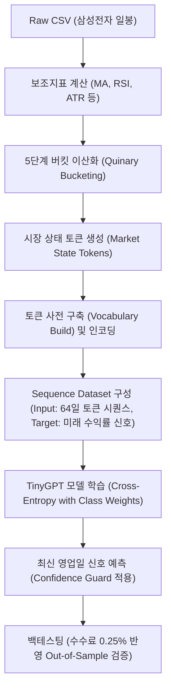

# TinyGPT Stock Trading Signal Model (Samsung Electronics)

이 프로젝트의 시그널 생성은 [TinyGPT 레포지토리](https://github.com/dulee0930/TinyGPT)의 모델 구조(Karpathy의 `makemore` 시리즈 중 **GPT-2 스타일의 Transformer Decoder 아키텍처 - Notebook 06**)를 기반으로 작동합니다. 주식 시장(삼성전자)의 일봉 데이터를 분석하고 최적의 **매수(BUY) / 관망(HOLD) / 매도(SELL)** 신호를 예측하는 딥러닝 프로젝트입니다.

이 프로젝트의 구현 코드는 [tiny_GPT_trading_signal_real.ipynb](file:///c:/Users/dulee0930/Desktop/2026-1/TinyGPT/tiny_GPT_trading_signal_real.ipynb)에 담겨 있습니다.

---

## 💡 핵심 아이디어 (Discretization & Tokenization)

전형적인 시계열 회귀 분석(Regression) 모델은 주가나 보조지표의 연속적인 실수(Float) 값을 직접 입력으로 받습니다. 하지만 이 모델은 다음과 같은 독창적인 방식을 사용합니다.

1. **시장 상태 토큰화 (Market State Tokenization)**: 주가 변화율, 거래량 비율, RSI, 변동성 등 6가지 핵심 재무 지표를 각각 5단계(Quinary Bucket)로 이산화(Discretization)한 후, 이를 결합하여 **하나의 문자 토큰(String Token)**으로 결합합니다.
   * *예시 토큰*: `T_FLAT|M5_NEU|M20_NEG|RSI_NEUTRAL|VOL_NORMAL|RNG_LOW` (추세는 횡보, 5일 모멘텀은 중립, 20일 모멘텀은 하락, RSI는 중립, 거래량은 평균, 변동성은 낮음)
2. **언어 모델처럼 처리**: 하나의 주식 거래일을 하나의 '단어(Token)'로, 최근 64일간의 시장 흐름을 하나의 '문장(Sentence)'으로 취급하여 GPT 모델에게 시장의 역사적 패턴을 읽게 합니다.
3. **분류 헤드(Classification Head) 적용**: 문맥 창(`block_size=64`)의 마지막 토큰 시점에서 추출된 은닉 상태(Hidden State)를 바탕으로, 미래 $H$일 동안의 수익률을 예측하는 분류(Classification)를 수행합니다.

---

## 🛠️ 전체 파이프라인 구조



---

## 1. 데이터 및 피처 엔지니어링 (Feature Engineering)

### 1) 입력 데이터 ([Samsung_Daily_Data_yfinance.csv](file:///c:/Users/dulee0930/Desktop/2026-1/TinyGPT/Samsung_Daily_Data_yfinance.csv))
* 야후 파이낸스(yfinance) 등에서 추출한 일봉 데이터로, 시가(`Open`), 고가(`High`), 저가(`Low`), 종가(`Close`), 거래량(`Volume`) 등을 포함합니다.

### 2) 보조지표 계산
* **이격도 (Close-MA Gap)**: 종가와 20일 이동평균선의 괴리율
* **단기 모멘텀 (`ret_5`)**: 5일 주가 수익률
* **중기 모멘텀 (`ret_20`)**: 20일 주가 수익률
* **상대강도지수 (`rsi14`)**: 14일 기준 RSI
* **거래량 비율 (`volume_ratio`)**: 현재 거래량 대비 20일 이동평균 거래량 비율
* **변동성 프록시 (`atr_proxy`)**: 최근 14일 동안의 일중 변동폭(고가-저가)의 이동평균 비율

### 3) 5단계 버킷 및 토큰 문자열 조합 (`make_market_state_tokens`)
각 지표의 크기에 따라 분위수(Boundary)를 기준으로 5가지 텍스트 라벨을 부여합니다.

* **추세 (Trend)**: `S_DOWN` (이격도 $\le -5\%$) / `DOWN` / `FLAT` ($|이격도| < 1.5\%$) / `UP` / `S_UP` ($\ge 5\%$)
* **단기 모멘텀 (M5)**: `S_NEG` (수익률 $\le -3\%$) / `NEG` / `NEU` ($|수익률| < 1\%$) / `POS` / `S_POS` ($\ge 3\%$)
* **중기 모멘텀 (M20)**: `S_NEG` (수익률 $\le -6\%$) / `NEG` / `NEU` ($|수익률| < 2\%$) / `POS` / `S_POS` ($\ge 6\%$)
* **RSI**: `OVERSOLD` ($\le 30$) / `WEAK` / `NEUTRAL` ($45 \sim 55$) / `STRONG` / `OVERBOUGHT` ($\ge 70$)
* **거래량 (VOL)**: `V_LOW` ($\le 60\%$) / `LOW` / `NORMAL` / `HIGH` / `V_HIGH` ($\ge 150\%$)
* **변동성 (RNG)**: `V_LOW` ($\le 1.5\%$) / `LOW` / `NORMAL` / `HIGH` / `V_HIGH` ($\ge 4.5\%$)

이 지표들을 조합하여 하나의 고유한 문자열 토큰으로 결합합니다. 조합된 토큰은 고유 정수 ID로 맵핑되며, 사전에 없는 신규 패턴은 `<UNK>`로 처리됩니다.

---

## 2. 타겟 신호 라벨링 (Target Labeling)

미래 $H$일 간의 선행 수익률(`future_return`)을 기준으로 학습 레이블(`label_id`)을 계산합니다.
* **BUY (2)**: 미래 수익률 $\ge$ `buy_threshold` (예: $+2\%$)
* **SELL (0)**: 미래 수익률 $\le$ `sell_threshold` (예: $-2\%$)
* **HOLD (1)**: 주가 변동폭이 임계값 이내일 때

---

## 3. Tiny GPT 모델 아키텍처 (`TinyGPTTradingSignal`)

이 모델은 [notebook_06.ipynb](file:///c:/Users/dulee0930/Desktop/2026-1/TinyGPT/notebook_06.ipynb)의 디코더 모델 구조와 동일한 뼈대를 갖지만, 최종 출력 레이어가 문자 생성 대신 **3클래스 분류(Classification)**를 수행한다는 차이점이 있습니다.

```
       [Input Context IDs: (B, 64)]
                    │
                    ▼
      [Token & Pos Embeddings (C=96)]
                    │
                    ▼
     ┌─────────────────────────────┐
     │      Transformer Block      │ x 3 Layers
     │   - Pre-LN LayerNorm        │
     │   - Multi-Head Attention    │
     │   - FeedForward (ReLU)      │
     │   - Residual Connections    │
     └─────────────────────────────┘
                    │
                    ▼
             [Final LayerNorm]
                    │
                    ▼
     [Extract Last Hidden: h[:, -1, :]] ➔ 64일간의 context 정보가 압축됨 (B, 96)
                    │
                    ▼
     [Linear Classification Head] ➔ Logits (B, 3) (SELL/HOLD/BUY)
```

### 모델 구성 클래스
* **[Head](file:///c:/Users/dulee0930/Desktop/2026-1/TinyGPT/tiny_GPT_trading_signal_real.ipynb#L31-L38)**: 단일 인과적(Causal) 어텐션 헤드로, 미래 정보를 참조할 수 없도록 하삼각 마스킹(`tril`)을 적용합니다.
* **[MultiHeadAttention](file:///c:/Users/dulee0930/Desktop/2026-1/TinyGPT/tiny_GPT_trading_signal_real.ipynb#L39-L43)**: 여러 개의 어텐션 헤드를 병렬 연산하고 합친 뒤 선형 투영합니다.
* **[FeedForward](file:///c:/Users/dulee0930/Desktop/2026-1/TinyGPT/tiny_GPT_trading_signal_real.ipynb#L44-L48)**: $W_1 x + b_1 \rightarrow \text{ReLU} \rightarrow W_2 x + b_2$ 구조의 MLP 채널 정제망입니다.
* **[Block](file:///c:/Users/dulee0930/Desktop/2026-1/TinyGPT/tiny_GPT_trading_signal_real.ipynb#L49-L51)**: Pre-LN 기반의 레이어 정규화와 어텐션, FFWD 및 잔차 연결을 조합한 디코더 블록입니다.
* **[TinyGPTTradingSignal](file:///c:/Users/dulee0930/Desktop/2026-1/TinyGPT/tiny_GPT_trading_signal_real.ipynb#L52-L86)**: 위의 요소들을 취합하여 토큰/위치 임베딩을 거쳐 시퀀스 특징을 만들고, **시퀀스의 마지막 시점 은닉 벡터(`h[:, -1, :]`)**를 추출하여 3개의 출력 신호 점수로 매핑합니다.

---

## 4. 모델 학습 기법 및 사양

* **클래스 불균형 완화 (`make_class_weights`)**: 금융 시계열 데이터의 특성상 `HOLD` 신호의 비율이 지배적입니다. 손실 함수 내에서 과도한 HOLD 편향을 막기 위해 훈련 데이터 내 레이블 빈도의 역수를 계산해 손실 가중치(`class_weights`)로 반영합니다.
* **학습률 스케줄러**: `CosineAnnealingLR`을 활용하여 초기 `lr=5e-4`에서 시작해 최소 5% 수준까지 코사인 곡선을 그리며 학습률을 조절합니다.
* **조기 종료 (Early Stopping)**: 검증 Loss가 연속 6에폭 동안 유의미하게 개선되지 않으면 학습을 정지하고 최적 가중치를 복원합니다.
* **가중치 파라미터**: `emb_dim = 96`, `num_heads = 4`, `num_layers = 3`, `dropout = 0.15`

---

## 5. 실전 리스크 관리: Confidence Guard

안정적인 자산 운용을 위해 모델 예측 확률값에 가드(Guard) 장치를 둡니다.
* **로직**: 모델이 `BUY` 또는 `SELL` 신호를 예측했더라도, 해당 클래스의 소프트맥스 확률(Confidence)이 사용자 설정값 `min_confidence` (예: $45\%$) 미만일 경우 무리하게 매수/매도하지 않고 **신호를 강제로 `HOLD`로 하향 조정**합니다.
* 이를 통해 불확실성이 높은 국면에서의 잦은 매매와 거래 비용(수수료, 슬리피지)을 억제합니다.

---

## 6. 백테스팅 (Backtesting)

모델이 뱉어낸 과거 전체 히스토리 신호를 시뮬레이션하여 성과를 평가합니다.

1. **포지션 스위칭**:
   * `BUY` 신호 발생 시: 포지션 1.0 (매수 후 보유)
   * `SELL` 신호 발생 시: 포지션 0.0 (청산 후 현금화)
   * `HOLD` 신호 발생 시: 기존 포지션 유지
2. **현실적인 거래 수수료 반영 (Out-of-Sample)**:
   * 포지션의 크기가 변할 때마다 매매 대금의 **0.25%**를 거래 수수료 및 슬리피지로 차감 계산하여 실질 수익률을 산출합니다.
3. **지표 검증**:
   * 누적 수익률 (Cumulative Return)
   * 최대 낙폭 (MDD: Maximum Drawdown)
   * Sharpe Ratio (샤프 지수)
   * 단순 보유 전략 (Buy & Hold) 대비 초과 수익률(Alpha) 비교

---

## ⚙️ 실행 및 운영 방법

### 1) 데이터 준비 및 피처 생성
[Samsung_Daily_Data_yfinance.csv](file:///c:/Users/dulee0930/Desktop/2026-1/TinyGPT/Samsung_Daily_Data_yfinance.csv) 경로에 최신 삼성전자 일봉 데이터를 준비합니다. 필수 열 목록은 다음과 같습니다.
* `stck_bsop_date` (영업일자, YYYYMMDD 또는 YYYY-MM-DD)
* `stck_oprc` (시가), `stck_hgpr` (고가), `stck_lwpr` (저가), `stck_clpr` (종가), `acml_vol` (누적 거래량)

### 2) 모델 학습 및 단일 신호 예측 실행
주피터 노트북 환경에서 순서대로 셀을 실행하거나 다음 파이썬 스크립트를 작성하여 작동시킵니다.
```python
from pathlib import Path
from tiny_GPT_trading_signal_real import load_and_build_features, TrainingConfig, TinyGPTTradingSignal, make_loaders

CSV_PATH = Path("Samsung_Daily_Data_yfinance.csv")
cfg = TrainingConfig()

# 1. 피처 데이터프레임 로드
df = load_and_build_features(CSV_PATH, cfg)

# 2. 데이터로더 생성 및 모델 정의
# (노트북 셀의 흐름을 따라 학습 루프를 구동합니다.)
```

### 3) 실전 매매 자동화 연동
모델 학습 완료 후 최신 영업일 기준 64일의 데이터를 넣으면 단일 예측 신호가 출력됩니다. 이 결과는 JSON 파일([latest_trading_signal.json](file:///c:/Users/dulee0930/Desktop/2026-1/TinyGPT/latest_trading_signal.json))로 자동 저장되며, 한국투자증권 등 자동매매 API와 직접 연동하여 실거래 주문에 연동할 수 있습니다.
```json
{
  "date": "2026-06-09",
  "raw_signal": "BUY",
  "trading_signal": "BUY",
  "confidence": 0.5421,
  "action_blocked_by_confidence": false
}
```
* 만약 `raw_signal`이 `BUY`이지만 확신도(confidence)가 부족해 강제 차단되었다면 `trading_signal`은 `HOLD`로 표시되며 `action_blocked_by_confidence`가 `true`가 됩니다.
