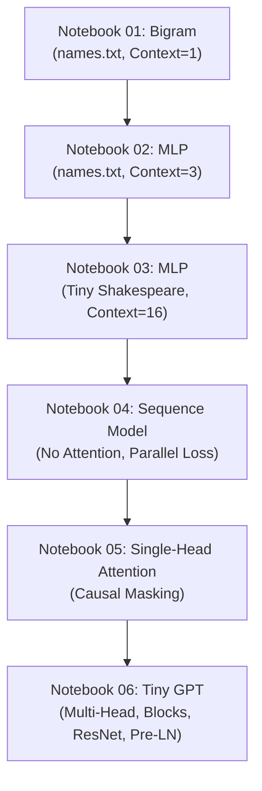

# TinyGPT: Notebook 01 ~ 06 모델 아키텍처 및 구현 디테일 가이드

이 문서는 `notebook_01.ipynb`부터 `notebook_06.ipynb`까지 진행되는 **Bigram 모델에서부터 Transformer Decoder (TinyGPT) 모델까지의 아키텍처 발전 과정 및 상세 사양**을 담고 있습니다.

---

## 📌 모델 발전 흐름 요약 (Roadmap)



---

## 1. Notebook 01: Bigram Language Model (`names.txt`)

가장 기초적인 문자 단위(Character-level) 언어 모델로, **바로 직전의 글자 1개**만을 보고 다음 글자 1개를 예측하는 Bigram 확률 모델입니다.

### 1) 데이터 및 학습 목표
* **데이터셋**: 영어 이름 목록인 `names.txt` (총 32,033개 단어)
* **어휘 사전 (Vocabulary)**: 알파벳 26개 + 단어의 시작과 끝을 나타내는 특수 기호 마침표(`.`) = 총 27개 (`vocab_size = 27`)
* **입력 및 출력**: 
  * 입력 (Context): 문자 1개 (인덱스 크기: `block_size = 1`)
  * 출력 (Target): 바로 다음 문자 1개

### 2) 모델 아키텍처
Notebook 01에서는 두 가지 방식의 Bigram을 구현합니다.
1. **명시적 One-hot 행렬곱 버전**:
   * 입력 정수 인덱스 $x$를 27차원의 원핫 벡터로 변환합니다.
   * 가중치 파라미터 행렬 $W$ (크기 $27 \times 27$)와 원핫 벡터를 행렬 곱셈하여 로그 확률 점수(Logits)를 구합니다.
   * $\text{logits} = x_{\text{onehot}} W$
2. **Embedding 룩업 테이블 버전**:
   * One-hot 연산은 메모리 낭비가 심하므로, PyTorch의 `nn.Embedding` 테이블(크기 $27 \times 27$)을 이용하여 인덱스 $x$의 행을 바로 조회(Lookup)합니다.
   * $\text{logits} = \text{EmbeddingTable}(x)$

### 3) 학습 및 하이퍼파라미터
* **손실 함수**: Cross Entropy Loss
* **최적화 도구**: `AdamW` (학습률 `lr = 1e-1`)
* **에폭 (Epochs)**: 20 에폭
* **최종 Loss**: 약 `2.52` 내외

---

## 2. Notebook 02: MLP Character Model (`names.txt`)

인접한 단일 문자만 고려하던 Bigram의 한계를 극복하기 위해, **이전 문자 $N$개(문맥 창 크기)**를 보고 다음 문자를 예측하는 **다층 퍼셉트론(MLP) 모델**입니다. (Bengio et al. 2003 논문 기반)

### 1) 데이터 및 학습 목표
* **데이터셋**: `names.txt`
* **문맥 창 크기 (`block_size`)**: 3 (이전 문자 3개를 보고 다음 문자 예측)
* **Sliding Window Dataset**: 
  * 예: 단어 `emma`에 대해
  * `[...] -> e`, `[..e] -> m`, `[.em] -> m`, `[emm] -> a`, `[mma] -> .` 와 같이 한 칸씩 밀어가며 데이터셋 쌍 생성

### 2) 모델 아키텍처
```
[Input: (B, 3)] 
       │
       ▼
[Embedding Layer: nn.Embedding(27, 10)] ──► 각 문자를 10차원 벡터로 투영 (B, 3, 10)
       │
       ▼
[Flatten Layer: nn.Flatten()] ──► 3개 문자의 벡터를 일렬로 이어 붙임 (B, 30)
       │
       ▼
[Hidden Layer: nn.Linear(30, 200) + nn.Tanh()] ──► 비선형 활성화 함수 적용 (B, 200)
       │
       ▼
[Output Layer: nn.Linear(200, 27)] ──► 다음 문자의 27개 클래스별 Logits 출력 (B, 27)
```

### 3) 학습 및 하이퍼파라미터
* **임베딩 차원 (`emb_dim`)**: 10
* **은닉층 노드 수 (`hidden_dim`)**: 200
* **최적화 도구**: `AdamW` (학습률 `lr = 1e-2`)
* **에폭 (Epochs)**: 30 에폭
* **최종 Loss**: 약 `2.26` 내외 (Bigram에 비해 문맥이 넓어져 예측력이 향상됨)

---

## 3. Notebook 03: MLP on Tiny Shakespeare

동일한 MLP 아키텍처를 유지한 상태에서, 단어 매칭 수준을 넘어 **문장 및 대본 데이터셋**을 학습하기 위해 데이터 규모를 대폭 확장한 단계입니다.

### 1) 데이터 및 학습 목표
* **데이터셋**: 셰익스피어 희곡 대본 `input.txt` (총 1,115,394자)
* **어휘 사전 (Vocabulary)**: 대본에 등장하는 모든 알파벳, 숫자, 문장 부호 및 공백문자 = 총 65개 (`vocab_size = 65`)
* **문맥 창 크기 (`block_size`)**: 16 (이전 16글자를 기반으로 다음 글자 예측)

### 2) 모델 아키텍처
* **임베딩 차원 (`emb_dim`)**: 64 (표현 용량 확장)
* **은닉층 노드 수 (`hidden_dim`)**: 256
* **구조**: `nn.Embedding(65, 64)` ➔ `nn.Flatten()` ➔ `nn.Linear(1024, 256)` ➔ `nn.Tanh()` ➔ `nn.Linear(256, 65)`

### 3) 학습 및 하이퍼파라미터
* **최적화 도구**: `AdamW` (학습률 `lr = 1e-3`)
* **학습 단계 수**: 최대 에폭당 300스텝 제한(학습 속도 조절용)

---

## 4. Notebook 04: GPT-style Dataset + Minimal Sequence Model

기존 MLP의 "과거 $N$개를 보고 다음 1글자만 맞추는" 형태의 비효율성을 해소하고, GPT 스타일의 **시퀀스 병렬 학습(Sequence-to-Sequence)**을 도입한 분기점입니다.

### 1) GPT-style Dataset
* **기존 방식 (MLP)**: 1개 데이터가 1개의 정답을 타겟으로 함. (학습 효율 저조)
* **GPT 방식**: 길이 `block_size`의 시퀀스가 들어왔을 때, 시퀀스 내의 **모든 위치**에서 각각 다음 글자를 동시에 예측하도록 구성.
  * 입력 시퀀스 $X$: `[x[0], x[1], ..., x[T-1]]`
  * 정답 시퀀스 $Y$: `[x[1], x[2], ..., x[T]]` (1칸씩 평행이동)
* **문맥 창 크기 (`block_size`)**: 32

### 2) 모델 아키텍처 (TinySequenceLM)
Attention 연산이 없는 상태에서 시퀀스 차원 전체를 독립적으로 매핑하는 구조입니다.
* **Token Embedding**: `nn.Embedding(vocab_size, emb_dim=64)`
* **Position Embedding**: `nn.Embedding(block_size, emb_dim=64)` ➔ 시퀀스 내 각 토큰의 절대적 위치(0~31) 정보를 부여합니다.
* **합산**: `x = Token_Embedding(x) + Position_Embedding(positions)`
* **LM Head**: `nn.Linear(emb_dim, vocab_size)`를 통해 바로 최종 예측 수행 (B, T, V)

```
Input: (B, T) ➔ Embedding (B, T, C) + Pos_Embedding (T, C) ➔ Head ➔ Output Logits (B, T, V)
```

### 3) Loss 및 차원 변환
전체 시퀀스 위치에서 오차를 계산하므로 Loss 계산 시 3차원 Logits을 2차원으로 변환해 줍니다.
* **로직**: `logits.transpose(1, 2)`를 적용하여 차원을 `(B, V, T)`로 변경한 후 `F.cross_entropy(logits, targets)` 적용

---

## 5. Notebook 05: Single-Head Masked Self-Attention

시퀀스 내에서 **정보의 가중치를 동적으로 계산**하는 핵심 메커니즘인 **인과적 셀프 어텐션(Causal Masked Self-Attention)**을 추가한 단계입니다.

### 1) Masked Self-Attention 핵심 연산
1. **Query, Key, Value 생성**:
   * 임베딩된 벡터 $X$ (B, T, C)에 Linear Projection을 적용하여 $Q, K, V$ 생성
   * $Q = X W_q,\quad K = X W_k,\quad V = X W_v$
2. **어텐션 스코어 계산**:
   * 쿼리와 키의 유사도를 행렬곱으로 구하고 스케일링합니다.
   * $\text{Raw Scores} = \frac{Q K^T}{\sqrt{d_k}}$
3. **인과적 마스킹 (Causal Masking)**:
   * 미래 시점의 글자를 참조하지 못하도록 하삼각행렬(`tril`) 이외의 영역을 $-\infty$로 채웁니다.
   * $\text{Masked Scores} = \text{Raw Scores} \odot M \quad \text{where } M_{ij} = \begin{cases} 0 & (i \ge j) \\ -\infty & (i < j) \end{cases}$
4. **가중치 분포 및 출력**:
   * 소프트맥스를 취해 비율을 구한 뒤, Value 벡터에 가중합합니다.
   * $\text{Attention}(Q, K, V) = \text{softmax}(\text{Masked Scores}) V$

### 2) 모델 아키텍처 (TinyAttentionLM)
* **구조**: Token + Pos Embedding ➔ **Single-Head Self-Attention Layer** ➔ Linear Output (LM Head)
* **임베딩 차원 (`emb_dim`)**: 64
* **문맥 창 크기 (`block_size`)**: 32

---

## 6. Notebook 06: Toward a Tiny GPT

Transformer Decoder 블록을 여러 층 깊게 쌓아 올린, 최종 완성형태의 **Mini GPT (TinyGPT)** 모델입니다.

### 1) 핵심 구성 요소

#### ① Multi-Head Attention (MHA)
단일 헤드로 어텐션을 계산하면 한 가지 관계만 포착하므로, 여러 개(`num_heads`)의 단일 어텐션 헤드를 병렬로 설계하여 다양한 문맥적 정보 관계를 동시에 학습합니다.
* 개별 헤드의 크기: `head_size = emb_dim // num_heads`
* 병렬 연산 후 접합(Concatenation)하고 선형 투영(`self.proj`)을 통과시킵니다.

#### ② FeedForward Network (FFWD)
어텐션 결과로 융합된 토큰 벡터들을 독립적으로 한 번 더 정제하는 선형 채널 변환층입니다.
* `nn.Linear(emb_dim, 4 * emb_dim)` ➔ `nn.ReLU()` ➔ `nn.Linear(4 * emb_dim, emb_dim)` ➔ `Dropout`

#### ③ Block (Transformer Decoder Block)
MHA와 FFWD를 하나로 묶어 잔차 연결(Residual Connection) 및 레이어 정규화(LayerNorm)를 배치한 기본 블록입니다. **Pre-LN** 구조를 차용했습니다.
* `x = x + self.sa(self.ln1(x))`
* `x = x + self.ffwd(self.ln2(x))`

### 2) TinyGPT 전체 사양
* **토큰 임베딩 + 위치 임베딩**
* **Transformer Decoder 블록 스택**: `num_layers = 4`
* **최종 레이어 정규화 (LayerNorm)**
* **LM Head (출력 선형 계층)**

```
Input (B, T)
  │
  ▼
[Token & Pos Embedding] ➔ (B, T, 128)
  │
  ▼
┌─► [LayerNorm ➔ Multi-Head Attention (4 Heads)] ──┐ (Residual Connection 1)
└──────────────────────────(+)─────────────────────┘
  │
  ▼
┌─► [LayerNorm ➔ FeedForward (ReLU, Dropout)] ─────┐ (Residual Connection 2)
└──────────────────────────(+)─────────────────────┘
  │  (위 블록 x 4회 반복)
  ▼
[Final LayerNorm]
  │
  ▼
[LM Head] ➔ Logits (B, T, 65)
```

### 3) 학습 및 하이퍼파라미터
* **모델 차원 (`emb_dim`)**: 128
* **헤드 개수 (`num_heads`)**: 4
* **레이어 블록 층수 (`num_layers`)**: 4
* **드롭아웃 비율 (`dropout`)**: 0.1
* **학습률 (`lr`)**: `3e-4` (GPT 표준 학습률)
* **문맥 창 크기 (`block_size`)**: 64

---

## 📊 모델 스펙 및 학습 비교표

| 항목 | Notebook 01 | Notebook 02 | Notebook 03 | Notebook 04 | Notebook 05 | Notebook 06 (TinyGPT) |
| :--- | :---: | :---: | :---: | :---: | :---: | :---: |
| **대상 데이터** | names.txt | names.txt | Shakespeare | Shakespeare | Shakespeare | Shakespeare |
| **사전 크기 (Vocab)** | 27 | 27 | 65 | 65 | 65 | **65** |
| **문맥 길이 (Block)** | 1 | 3 | 16 | 32 | 32 | **64** |
| **임베딩 차원 (Emb)** | 27 (또는 direct) | 10 | 64 | 64 | 64 | **128** |
| **어텐션 헤드 수** | - | - | - | - | 1 (Single) | **4 (Multi-Head)** |
| **블록 레이어 수** | - | - | - | - | - | **4** |
| **드롭아웃** | - | - | - | - | - | **0.1** |
| **학습 방식** | 1:1 예측 | 1:1 예측 | 1:1 예측 | 시퀀스 병렬 | 시퀀스 병렬 | **시퀀스 병렬** |
| **최적화 lr** | 1e-1 | 1e-2 | 1e-3 | 1e-3 | 1e-3 | **3e-4** |
